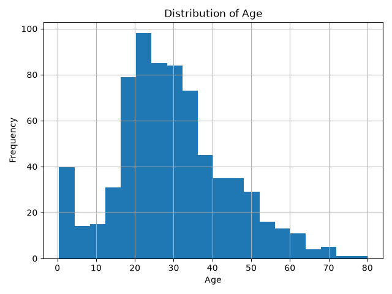
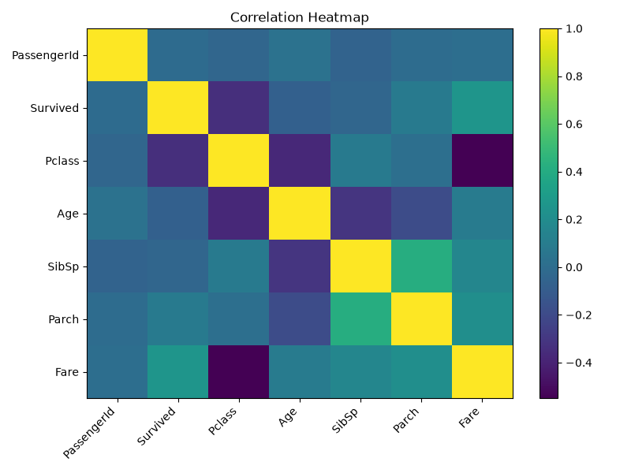

# Data Inspector

Data Inspector is a Python command-line tool for performing an initial inspection of CSV datasets. The project was developed as part of the Introduction to Python course at TU Dortmund University.

The goal of the project is to provide a quick overview of an unfamiliar dataset before performing more detailed data analysis.

## Features

Data Inspector provides:

- dataset dimensions
- column names and data types
- missing-value counts and percentages
- duplicate-row detection
- separation of numerical and categorical columns
- descriptive statistics for numerical variables
- IQR-based potential outlier detection
- correlation analysis
- automatic distribution plots for suitable numerical variables
- a correlation heatmap
- formatted command-line reports

## Example Output

Data Inspector automatically generates visualizations for numerical data.

### Numeric Distribution

The following example shows the distribution of a numerical variable:



### Correlation Heatmap

The correlation heatmap provides an overview of linear relationships between numerical variables:



## Installation

Clone the repository and install the package from the project directory:

```bash
uv pip install -e .
```

To install the optional dependencies required for testing:

```bash
uv pip install -e ".[test]"
```

## Usage

Run Data Inspector from the project directory and provide the path to a CSV dataset:

```bash
uv run -m data_inspector path/to/dataset.csv
```

For example:

```bash
uv run -m data_inspector my_dataset.csv
```

Data Inspector prints the analysis report directly to the terminal.

Generated visualizations are saved automatically in the `plots/` directory.

## Analysis Report

The command-line report contains:

- number of rows and columns
- duplicate-row count
- missing-value counts and percentages
- detected data types
- descriptive statistics
- potential outlier counts
- correlations between numerical variables
- numerical and categorical column lists

## Testing

The project uses `pytest` for automated testing.

Run the complete test suite with:

```bash
uv run pytest
```

The tests cover:

- basic dataset analysis
- missing-value calculations
- IQR-based outlier detection
- CSV file loading
- validation of unsupported file formats

## Project Structure

```text
data-inspector/
├── src/
│   └── data_inspector/
│       ├── __init__.py
│       ├── __main__.py
│       ├── analyzer.py
│       ├── cli.py
│       ├── report.py
│       └── visualizer.py
├── tests/
│   └── test_analyzer.py
├── plots/
│   ├── Age_distribution.png
│   └── correlation_heatmap.png
├── .gitignore
├── pyproject.toml
├── uv.lock
└── README.md
```

## Package Design

The project is organized into reusable components.

### Analyzer

`analyzer.py` contains functions for:

- loading CSV datasets
- performing basic dataset analysis
- calculating missing-value statistics
- calculating correlations
- detecting potential outliers using the IQR method

### Visualizer

`visualizer.py` contains reusable functions for generating and saving:

- numerical distribution plots
- correlation heatmaps

### Report

`report.py` contains the `DatasetReport` class, which formats analysis results for command-line output.

### Command-Line Interface

`cli.py` coordinates dataset loading, analysis, visualization, and report generation.

`__main__.py` allows the package to be executed directly with:

```bash
uv run -m data_inspector path/to/dataset.csv
```

The main package components are exposed through `data_inspector.__init__`.

## Technologies

The project uses:

- Python 3.10+
- pandas
- Matplotlib
- pytest
- uv

## Current Limitations

The current version supports CSV files only.

Potential outliers are identified using the IQR rule. These observations should be interpreted as potentially unusual values that may require further investigation rather than automatically being classified as data errors.

Correlation analysis is performed only for numerical columns and represents linear relationships between variables.

## Future Improvements

Possible extensions of the project include:

- support for additional file formats such as Excel and JSON
- configurable visualization options
- export of analysis results to a report file
- additional statistical summaries
- more advanced data-quality checks